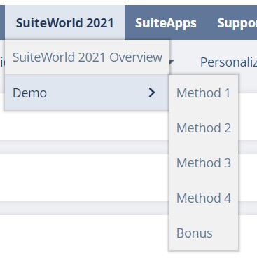

# Overview
This SuiteApp contains the codes and objects used in the SuiteWorld 2021 session entitled *"Superpowers for Your SuiteApps How to Use Open Source Libraries"*. Once deployed, a new Center Tab should become available.


# Prerequisites
You should be able to deploy this project as is and confirm that all methods are working. But in order to see Method 4's build process, ensure that:
- NodeJS is installed (tested in v14.7.0)
- Oracle JET 11's CLI is globally installed
```
npm install -g @oracle/ojet-cli
```
- The node modules are installed in the root folder
```
npm install
```
- The npm modules are installed in the `JET` folder and the `ojet restore` is run
```
cd JET
npm install
ojet restore
```

# Method 4: Building and Serving
Note that these commands should be run in the root folder:
- to run a local webserver and host the JET view
```
gulp serve --view=jet/DemoCharts
```
- to build the output file to be added in `FileCabinet`
```
gulp build --view=jet/DemoCharts
```
